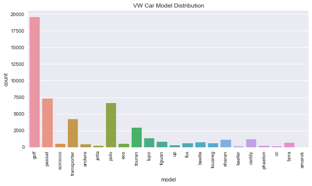

——
layout: post
title: Price prediction model with multivariate linear regression in Python
date: 2017-07-16 15:00:00
——

### Introduction

Multivariate linear regression is a simple statistical technique to make predictions about a feature based on its characteristics. These characteristics in statistical terms are known as predictor or independent variables; while the value the model predicts is known as dependent variable.

Here, I will be using a [dataset](https://www.kaggle.com/orgesleka/used-cars-database) for used cars from Kaggle. The reason I chose this dataset was because it contains several continuous and categorical variables, which make the model building interesting. Also, it provides an opportunity to understand how to use categorical variables in a regression model since they cannot be used directly. This topic, however, will be discussed in the next post, which will shotly follow this post.

With that said, let us begin building our model...

### Importing necessary python libraries

To begin building the model, the data first needs to be imported into python. Once the data is available in python it is then time to dwell deeper into exploring the data and determine what additional steps such as filling up missing data, create new variables, transform any of the continuous variables, etc may be required.

To perform all these operations few Python libraries need to be imported. Below is the list of libraries and their purpose:

1. *Pandas*: Import the data in a tabular format. Pandas recognizes data by columns and rows, making it easy to work with data.
2. *Numpy*: Numpy enables working data in array format. It also helps recognize NaN data format.
3. *Scipy.stats*: This library is primarily used to build QQ plots in order to visualize distribution.
4. *Datetime*: Datetime library allows to perform operations on date columns, read as string datatype, by converting them date datatype.
5. *Matplotlib.pyplot*: Ploting the data.
6. *Seaborn*: Although Seaborn package has many advanced features, its purpose here is to build prettier visuals.


```python
import pandas as pd
import matplotlib.pyplot as plt
import numpy as np
import scipy.stats as st
import datetime as dt
import seaborn as sns
```

### Importing  and Exploring the Data

To import the data from a CSV file, Pandas has a function called ```DataFrame.read_csv()```. The dataset, once imported, is assigned to a variable - in this case 'df_auto'. This function has many arguments one can provide in order to import the data as desired. Once the data import is complete, the ```DataFrame.head()``` funtion allows to view first few rows in the data. By default, the funtion displays first five rows. To view fewer or more rows just mention the desired number of rows within the parathesis of head funtion, e.g. ```DataFrame.head(10)```.


```python
df_auto = pd.read_csv('/Users/rajnikhil/Documents/Analytics/used-cars-database/autos.csv', encoding='latin-1')
```


```python
df_auto.head()
```


<div>
<style>
    .dataframe thead tr:only-child th {
        text-align: right;
    }

    .dataframe thead th {
        text-align: left;
    }

    .dataframe tbody tr th {
        vertical-align: top;
    }
</style>
<table border="1" class="dataframe">
  <thead>
    <tr style="text-align: right;">
      <th></th>
      <th>dateCrawled</th>
      <th>name</th>
      <th>seller</th>
      <th>offerType</th>
      <th>price</th>
      <th>abtest</th>
      <th>vehicleType</th>
      <th>yearOfRegistration</th>
      <th>gearbox</th>
      <th>powerPS</th>
      <th>model</th>
      <th>kilometer</th>
      <th>monthOfRegistration</th>
      <th>fuelType</th>
      <th>brand</th>
      <th>notRepairedDamage</th>
      <th>dateCreated</th>
      <th>nrOfPictures</th>
      <th>postalCode</th>
      <th>lastSeen</th>
    </tr>
  </thead>
  <tbody>
    <tr>
      <th>0</th>
      <td>2016-03-24 11:52:17</td>
      <td>Golf_3_1.6</td>
      <td>privat</td>
      <td>Angebot</td>
      <td>480</td>
      <td>test</td>
      <td>NaN</td>
      <td>1993</td>
      <td>manuell</td>
      <td>0</td>
      <td>golf</td>
      <td>150000</td>
      <td>0</td>
      <td>benzin</td>
      <td>volkswagen</td>
      <td>NaN</td>
      <td>2016-03-24 00:00:00</td>
      <td>0</td>
      <td>70435</td>
      <td>2016-04-07 03:16:57</td>
    </tr>
    <tr>
      <th>1</th>
      <td>2016-03-24 10:58:45</td>
      <td>A5_Sportback_2.7_Tdi</td>
      <td>privat</td>
      <td>Angebot</td>
      <td>18300</td>
      <td>test</td>
      <td>coupe</td>
      <td>2011</td>
      <td>manuell</td>
      <td>190</td>
      <td>NaN</td>
      <td>125000</td>
      <td>5</td>
      <td>diesel</td>
      <td>audi</td>
      <td>ja</td>
      <td>2016-03-24 00:00:00</td>
      <td>0</td>
      <td>66954</td>
      <td>2016-04-07 01:46:50</td>
    </tr>
    <tr>
      <th>2</th>
      <td>2016-03-14 12:52:21</td>
      <td>Jeep_Grand_Cherokee_"Overland"</td>
      <td>privat</td>
      <td>Angebot</td>
      <td>9800</td>
      <td>test</td>
      <td>suv</td>
      <td>2004</td>
      <td>automatik</td>
      <td>163</td>
      <td>grand</td>
      <td>125000</td>
      <td>8</td>
      <td>diesel</td>
      <td>jeep</td>
      <td>NaN</td>
      <td>2016-03-14 00:00:00</td>
      <td>0</td>
      <td>90480</td>
      <td>2016-04-05 12:47:46</td>
    </tr>
    <tr>
      <th>3</th>
      <td>2016-03-17 16:54:04</td>
      <td>GOLF_4_1_4__3TÜRER</td>
      <td>privat</td>
      <td>Angebot</td>
      <td>1500</td>
      <td>test</td>
      <td>kleinwagen</td>
      <td>2001</td>
      <td>manuell</td>
      <td>75</td>
      <td>golf</td>
      <td>150000</td>
      <td>6</td>
      <td>benzin</td>
      <td>volkswagen</td>
      <td>nein</td>
      <td>2016-03-17 00:00:00</td>
      <td>0</td>
      <td>91074</td>
      <td>2016-03-17 17:40:17</td>
    </tr>
    <tr>
      <th>4</th>
      <td>2016-03-31 17:25:20</td>
      <td>Skoda_Fabia_1.4_TDI_PD_Classic</td>
      <td>privat</td>
      <td>Angebot</td>
      <td>3600</td>
      <td>test</td>
      <td>kleinwagen</td>
      <td>2008</td>
      <td>manuell</td>
      <td>69</td>
      <td>fabia</td>
      <td>90000</td>
      <td>7</td>
      <td>diesel</td>
      <td>skoda</td>
      <td>nein</td>
      <td>2016-03-31 00:00:00</td>
      <td>0</td>
      <td>60437</td>
      <td>2016-04-06 10:17:21</td>
    </tr>
  </tbody>
</table>
</div>


In large datasets, especially those which have many columns/variables, it helps to views the names of the columns and their datatypes. Below is the list of columns in the df_auto dataset and their default dataset. To get this list Pandas has a function called ```DataFrame.dtypes```.

Pandas isn't always right in detecting the right datatype for a column. This can be seen in the case of first column 'dataCrawled', whose datatype is object. Object datatype is a generic type of categorical datatype, whereas it would be more logical for the datatype here to be some kind of data datatype. The steps to change the datatype will be carried on later in the data cleaning process.


```python
df_auto.dtypes
```


    dateCrawled            object
    name                   object
    seller                 object
    offerType              object
    price                   int64
    abtest                 object
    vehicleType            object
    yearOfRegistration      int64
    gearbox                object
    powerPS                 int64
    model                  object
    kilometer               int64
    monthOfRegistration     int64
    fuelType               object
    brand                  object
    notRepairedDamage      object
    dateCreated            object
    nrOfPictures            int64
    postalCode              int64
    lastSeen               object
    dtype: object


The ```DataFrame.describe()``` function gives parameters of the numeric variables. This command makes it extremely easy to view the range of variables, identify outliers (in some cases), gives an idea of their distribution, etc. For example, in the below table the column 'nrOfPictures' has all zeroes. Looking at this,it would be safe to drop this column from the dataset. Another example could be 'yearOfRegistration', where minimum year is 1000, which would be quite a vintage car, only if it were true!.


```python
df_auto.describe()
```


<div>
<style>
    .dataframe thead tr:only-child th {
        text-align: right;
    }

    .dataframe thead th {
        text-align: left;
    }

    .dataframe tbody tr th {
        vertical-align: top;
    }
</style>
<table border="1" class="dataframe">
  <thead>
    <tr style="text-align: right;">
      <th></th>
      <th>price</th>
      <th>yearOfRegistration</th>
      <th>powerPS</th>
      <th>kilometer</th>
      <th>monthOfRegistration</th>
      <th>nrOfPictures</th>
      <th>postalCode</th>
    </tr>
  </thead>
  <tbody>
    <tr>
      <th>count</th>
      <td>3.715280e+05</td>
      <td>371528.000000</td>
      <td>371528.000000</td>
      <td>371528.000000</td>
      <td>371528.000000</td>
      <td>371528.0</td>
      <td>371528.00000</td>
    </tr>
    <tr>
      <th>mean</th>
      <td>1.729514e+04</td>
      <td>2004.577997</td>
      <td>115.549477</td>
      <td>125618.688228</td>
      <td>5.734445</td>
      <td>0.0</td>
      <td>50820.66764</td>
    </tr>
    <tr>
      <th>std</th>
      <td>3.587954e+06</td>
      <td>92.866598</td>
      <td>192.139578</td>
      <td>40112.337051</td>
      <td>3.712412</td>
      <td>0.0</td>
      <td>25799.08247</td>
    </tr>
    <tr>
      <th>min</th>
      <td>0.000000e+00</td>
      <td>1000.000000</td>
      <td>0.000000</td>
      <td>5000.000000</td>
      <td>0.000000</td>
      <td>0.0</td>
      <td>1067.00000</td>
    </tr>
    <tr>
      <th>25%</th>
      <td>1.150000e+03</td>
      <td>1999.000000</td>
      <td>70.000000</td>
      <td>125000.000000</td>
      <td>3.000000</td>
      <td>0.0</td>
      <td>30459.00000</td>
    </tr>
    <tr>
      <th>50%</th>
      <td>2.950000e+03</td>
      <td>2003.000000</td>
      <td>105.000000</td>
      <td>150000.000000</td>
      <td>6.000000</td>
      <td>0.0</td>
      <td>49610.00000</td>
    </tr>
    <tr>
      <th>75%</th>
      <td>7.200000e+03</td>
      <td>2008.000000</td>
      <td>150.000000</td>
      <td>150000.000000</td>
      <td>9.000000</td>
      <td>0.0</td>
      <td>71546.00000</td>
    </tr>
    <tr>
      <th>max</th>
      <td>2.147484e+09</td>
      <td>9999.000000</td>
      <td>20000.000000</td>
      <td>150000.000000</td>
      <td>12.000000</td>
      <td>0.0</td>
      <td>99998.00000</td>
    </tr>
  </tbody>
</table>
</div>


As mentioned above, the column 'nrOfPictures' doesn't have any useful data and can hence be safely dropped from the analysis dataset. Other columns such as name, postalCode, and dateCrawled also don't have much useful information. The Postal Code column isn't useful since, unlike for USA, it is not easy to determine a neighborhood and its characteristics based on it zip code. The name column contains the name of the car but is not consistent with the way it has populated. Also, these details can be found in columns Brand and Model so name is a redundant column.

In order to exclude the above columns, one can either drop these columns from the dataset using ```DataFrame.drop([columns_names], axis=1)``` function or create a list of columns to keep and declare it as ```DataFrame[columns_names]```. In both these scenarios, the resultant should be assigned to a data frame to preserve the new dataset created. Assigning this new dataset to a new variable helps preserve the original dataset and allows for making any changes to the newly created dataset without importing the original dataset again.


```python
analysisCol = ['brand', 'model', 'vehicleType', 'yearOfRegistration', 'monthOfRegistration', 'kilometer', 'powerPS',
               'fuelType', 'gearbox', 'abtest', 'notRepairedDamage', 'seller', 'offerType', 'dateCreated', 
               'lastSeen', 'price']
```


```python
df_ncar = df_auto[analysisCol]
```

#### *Data Cleaning*

Data cleaning and exploration can be iterative process, i.e. after performing inital data exploration one may choose to clean some of the data and perform further exploration. As can be seen in the next few steps, this is the approach adopted here.

From the initial exploration using ```DataFrame.describe()``` function, a few unsual values as well as outliers were identified. Based on this, it is reasonable to drop these outliers and unusual values. This is performed in the next four steps below.


```python
#Drop rows where Year of registration is >=1950 and <=2016
df_ncar=df_ncar.drop(df_ncar[df_ncar["yearOfRegistration"]<1950].index)
df_ncar=df_ncar.drop(df_ncar[df_ncar["yearOfRegistration"]>2016].index)
```


```python
#Drop rows with Power >650
df_ncar=df_ncar.drop(df_ncar[df_ncar['powerPS']>650].index)
df_ncar=df_ncar.drop(df_ncar[df_ncar['powerPS']<40].index)
```


```python
#Drop rows where cars are priced below 1000 and above 35000
df_ncar=df_ncar.drop(df_ncar[df_ncar['price']<1000].index)
df_ncar=df_ncar.drop(df_ncar[df_ncar['price']>35000].index)
```


```python
#Drop rows where monthOfRegistration is 0
df_ncar = df_ncar.drop(df_ncar[df_ncar['monthOfRegistration']==0].index)
```

#### *Plotting Distribution*

After dropping the rows, the distribution of brands of cars is plotted in a barchart using Matplotlib and Seaborn packages.

Volkswagen, Mercedes and BMW seem to be three most popular brands in Germany. From the distribution of VW cars given in the second barchart, it is clear that with in Volkswagen, Golf is the most popular car. In fact, Golf seems to be the most popular car among all the models follow by Andere and 3er.

*Plotting code description*:

Most of the lines here are pretty self explanatory. The one that needs to be highlighted is ```%matplotlib inline```. This line allows for the graph to be plotted in line with the command as can be seen below.

```plt.figure(figsize=(width,height))``` defines the size of the chart.
```plt.title('Graph title here')``` is used to display the main title of the graph such as 'Brand Distribution'.
```sns.countplot(variable)``` is used to plot frequency of each category in a variable. This chart is created using Seaborn package. This is assigned to a variable in order define few features required in the graph to be plotted such as rotating names of the Brand on x-axis.
```g.set_xticktlabels(g.get_xticklabels(), rotation=90)``` is used to rotate names of the brand by 90 degrees. It is also fine to provide the column name such as ```DataFrame['Column']``` instead of using g.get_xticklabels().


```python
#Plot distribution of cars
%matplotlib inline
plt.figure(figsize=(13,7))
plt.title('Brand Distribution')
g = sns.countplot(df_ncar['brand'])
rot = g.set_xticklabels(g.get_xticklabels(), rotation=90)
```


*Filter rows based on a value*

To plot the distribution of just Volkswagen cars, the 'brand' column in the dataset has to filtered for Volkswagen. This is done in the second line of code in the below block of code. This is an example of single filter, it is also possible to filter a dataset by more than one condition but that is not required here.


```python
#Plot distribution of car models for a particular brand - I'm taking Volkswagen
%matplotlib inline
vw_cars = df_ncar[df_ncar['brand']=='volkswagen'] #Select data by a brand
plt.figure(figsize=(10,5))
plt.title('VW Car Model Distribution')
bm = sns.countplot(vw_cars['model'])
rot_bm=bm.set_xticklabels(bm.get_xticklabels(), rotation=90)
```





```python
#Plot distribution of all the cars
%matplotlib inline
plt.figure(figsize=(30,7))
plt.title('Car Model Distribution')
g=sns.countplot(df_ncar['model'])
rot=g.set_xticklabels(g.get_xticklabels(),rotation=90)
```


In order to build a better model, it is a good idea to narrow the dataset to only a few closely related groups. Because computing power is not very expensive this method is not very taxing.

Based on the above distribution, a separate predictive model can be built either for each brand or go a step further and build a predictive model for each car. In this case, a model is built for VW Golf alone.

***Working with dates in Pandas***

Dates and/or timestamps are ubiquitous in real world datasets and therefore knowing how to work with them in Pandas can be a real time saver along with providing some real valuable insights.

Here, dates are used to determine the age of a car and age of a listing in terms of days. Age of a car is determined based on the date of registration and date the listing for a car was last seen. Counting the number of days between these two dates will provide the age of the car. Age of a listing can be determined in the similar way based on dateCreated and dateLastSeen.

The reason for determining these two ages is that if the age of the car is more then it can have a negative impact on the price of a car. Effect of age of a listing is not very clear since a very expensive car can take longer to sell but doesn't necessarily have a negative impact as age of a car would, therefore, this is not used in the analysis.

When a dataset is imported using Pandas, date and/or timestamp columns are imported as object datatype. To update the datatype pandas has a function ```to_datetime(Date_Column)```. More details on this function can be found [here](https://pandas.pydata.org/pandas-docs/stable/generated/pandas.to_datetime.html). The columns in this dataset are timestamp. In order to extract the date, the ```.date``` function from datetime package is used.


```python
#Convert date columns to date datatype
df_ncar["lastSeen"]=pd.to_datetime(df_ncar["lastSeen"])
df_ncar["dateCreated"]=pd.to_datetime(df_ncar["dateCreated"])
#Extracting the date from datetime
df_ncar["lastSeenDate"]=df_ncar["lastSeen"].dt.date
df_ncar["dateCreatedDate"]=df_ncar["dateCreated"].dt.date
```

***Creating New Columns/Add Derived Columns***

As mentioned above, age of the car is derived based on two dates i.e. lastSeenDate and registerDate. However, registerDate is not a column that is present in the original data set. Therefore, this date needs to be derived based on other columns present in the data set. These other columns are:
1. yearOfRegistration
2. monthOfRegistration

The process to derive the registerDate involves four steps.
1. Concatenate 'yearOfRegistration' and 'monthOfRegistration' columns for each record in a column 'registerMonthYear'.
2. Day of the month on which the car was registered is assumed as 1st since this piece of data is missing in data set. This is based on the assumption that the difference between actual and assumed number of days will not affect the price much. Therefore, 01 is concatenated with the value for each record in 'registerMonthYear' column into the column 'registerDate'.
3. One the column 'registerDate' is created and populated, it needs to be converted to datetime datatype using pandas function ```to_datetime(date_column)``` discussed earlier.
4. Since, the result of the above step is a timestamp i.e. date along with time, another step is required to extract date from it. This is done by ```.date```, also discussed above.


```python
#Create column for date of registration of the car
df_ncar["registerMonthYear"] = df_ncar["yearOfRegistration"].astype(str).str.cat(df_ncar["monthOfRegistration"].astype(str), sep='-')
#Add the day of the month as 01 to the above column since date of the registration wasn't supplied (assuming this wouldn't seriously affect results)
df_ncar["registerDate"]=df_ncar["registerMonthYear"].astype(str)+'-01'
df_ncar["registerDate"]=pd.to_datetime(df_ncar["registerDate"])
df_ncar['registerDate']=df_ncar['registerDate'].dt.date
```

Number of days between two dates can be calcuated by subtracting earlier date from the later and can be stored in a new column called 'carAge'.

This operation however results in the word 'days' being appended at the end of the number. It is necessary to extract just the otherwise the column will have to treated as a categorical variable and will require dummy variable for each unique record in the resulting column. To do this, pandas text data functions ```str.split()``` and ```str.get()``` can be used. More information about each of these functions can be found [here](https://pandas.pydata.org/pandas-docs/stable/generated/pandas.Series.str.split.html) and [here](https://pandas.pydata.org/pandas-docs/stable/text.html).


```python
#Calculate age of the car, in terms of days, at the time the listing was last seen
df_ncar["carAge"]=df_ncar["lastSeenDate"]-df_ncar["registerDate"]
```


```python
#Remove the word 'days' from the carAge column
       # first convert listAge and carAge to string data type
df_ncar["carAge"]=df_ncar["carAge"].astype(str)
df_ncar["carAge"]=df_ncar.carAge.str.split(n=1).str.get(0)
df_ncar["carAge"]=df_ncar["carAge"].astype(str).astype(int)
```


```python
#drop rows where car age is less than or equal to 0
df_ncar=df_ncar.drop(df_ncar[df_ncar['carAge']<=0].index)
```

***Standardize continuous data columns***

Standardization is a procedure to make the mean of a column 0 and its standard deviation equal to 1. It is a good idea to standardize columns when their scales are very different. Such as Kilometer and Power in this data set, where kilometer in some cases is in hundreds of thousands of miles and power ranges from 40 to 650 - after filtering. This difference in scale can have an affect on the model created. To bring these two variables on the same scale, the columns have to be standardized.

To standardize a variable/column, just subtract mean of the variable from each record in the variable and divide by the standard deviation of the variable.

Standardization of Power and Kilometer variables can be seen in the steps below:


```python
#Standardize Power PS and Kilometer variables
df_ncar["s_powerPS"]=((df_ncar.powerPS-df_ncar.powerPS.mean())/df_ncar.powerPS.std())
df_ncar["s_kilometer"]=((df_ncar.kilometer-df_ncar.kilometer.mean())/df_ncar.kilometer.std())
```

As mentioned in the beginning, the topic on how to include categorical variables in regression will be discussed in the next post. Therefore in the step below a new data set is created that contains only those columns which will be used in building the first linear multivariate regression model.

Also, as discussed earlier, in order to build a better model, it will be build for a particular car. In this case, the car chosen is Volkswagen Golf since it is the car with most listings. 


```python
#Removing all the categorical columns and columns that have standardized or have been used to create new columns
df_newCar = df_ncar.drop(['vehicleType','yearOfRegistration','monthOfRegistration','kilometer','powerPS',
                          'fuelType','gearbox','abtest','notRepairedDamage','seller','offerType','dateCreated','lastSeen',
                         'lastSeenDate','dateCreatedDate','registerMonthYear','registerDate'], axis=1)
```


```python
#Building model for just one model - here I chose to build for VW Golf
df_newCar_volkswagenGolf=df_newCar
df_newCar_volkswagenGolf['brand'].replace('volkswagen',1, inplace=True)
df_newCar_volkswagenGolf['model'].replace('golf',1, inplace=True)
df_newCar_volkswagenGolf=df_newCar_volkswagenGolf.drop(df_newCar_volkswagenGolf[df_newCar_volkswagenGolf['brand']!=1].index)
df_newCar_volkswagenGolf=df_newCar_volkswagenGolf.drop(df_newCar_volkswagenGolf[df_newCar_volkswagenGolf['model']!=1].index)
```

### Analysing Variable Distribution and Apply Transformation

Although linear regression is quite robust to violation of normality assumption, it is still a good practise to transform data to normal distribution.

The distribution of variables before and after transformation are plotted below using QQ (Quantile-Quantile) plot from Scipy.stats - represented with 'st' - package.

The aim here is to bring all the observations (represented by blue dots) as close to the red line in as possible.


```python
#Distribution of carAge, s_kilometer, and s_powerPS variables
st.probplot(df_newCar_volkswagenGolf.carAge, plot=plt)
```


    ((array([-3.96981633, -3.75319737, -3.63464522, ...,  3.63464522,
              3.75319737,  3.96981633]),
      array([    1,     2,     2, ..., 14860, 14919, 16708])),
     (2338.8487246576542, 4442.18995485913, 0.98854950752531212))


Transformation is a vast topic in statistics and there are multiple transformations in which normal distribution can be achieved. Many times it is all about trying multiple methods and/or values and choose the best ones. Some of the most commonly employed methods are:
1. Log transformation (log(x))
2. Square root (sqrt(x))
3. Negative inverse (-1/x)

If the minimum value in a variable is 0, it always helps to add a constant to all the observations of the variable. This step is absolutely necessary if log transformation has to be performed.

To induce normal distribution in the carAge variable, it has been raised to power of 1/2 or 0.5.

To induce normal distribution in the standardized Power variable, 2 was added to all the observations in the variable since there are values present that less than, as can be seen from the initial QQ plot for the variable. After, adding the value 2, it is raised to power of -0.4.


```python
t_carAge=df_newCar_volkswagenGolf.carAge
df_newCar_volkswagenGolf['t_carAge'] = np.power(t_carAge,0.5)
st.probplot(df_newCar_volkswagenGolf['t_carAge'], plot=plt)
```


    ((array([-3.96981633, -3.75319737, -3.63464522, ...,  3.63464522,
              3.75319737,  3.96981633]),
      array([   1.        ,    1.41421356,    1.41421356, ...,  121.90159966,
              122.14335839,  129.25942906])),
     (18.967485596561378, 63.856672483380798, 0.9932671345947981))


```python
st.probplot(df_newCar_volkswagenGolf.s_powerPS, plot=plt)
```


    ((array([-3.96981633, -3.75319737, -3.63464522, ...,  3.63464522,
              3.75319737,  3.96981633]),
      array([-1.51627824, -1.41449702, -1.41449702, ...,  7.06727071,
              7.96633809,  8.5939889 ])),
     (0.67474723956931248, -0.31623638737936921, 0.89349546519672263))


```python
t_powerPS=df_newCar_volkswagenGolf.s_powerPS.add(2)
df_newCar_volkswagenGolf['t_powerPS']=np.power(t_powerPS,-0.4)
st.probplot(df_newCar_volkswagenGolf['t_powerPS'], plot=plt)
```


    ((array([-3.96981633, -3.75319737, -3.63464522, ...,  3.63464522,
              3.75319737,  3.96981633]),
      array([ 0.38902382,  0.39864448,  0.4140086 , ...,  1.23876338,
              1.23876338,  1.33709341])),
     (0.11922240544612582, 0.846479415408528, 0.98180259276932713))


*Interaction Among Variables*

Interaction among variables is when one independent/predictor variable can have an affect on another independent/predictor variable. It is important to consider this point since this can explain a significant part of the value being predicted.

Here, an interaction exists between Power and Kilometer. As the vehicle is driven more and more, the efficiency of its engine drops and will result in decrease in power. To include this factor, a new variable 'KM_Power' was created by multiplying the transformed Power (t_powerPS) variable and standardized kilometer (s_kilometer) variable.

One can now assume that there can be interaction between carAge and Kilometer since as the days, months and years pass the vehicle is driven more. However this may not always be true in the sense that a particular model of car for example VW Golf may not be driven same number of kilometers in a given duration of time. Therefore an interaction variable for these two variables was not created.


```python
#There is interaction between Power and Kilometer i.e. as the number of kilometers increase the power decreases.
df_newCar_volkswagenGolf['KM_Power']=df_newCar_volkswagenGolf['t_powerPS']*df_newCar_volkswagenGolf['s_kilometer']
```

*Building the final dataset to be used in predicting prices*

After all the cleaning, transformation, creating and deleting variables it finally time to create that one dataset which will be used to build the model, which will predict the price of a car.

In the step below this final dataset is created. This is then divided in order to create a training and testing dataset. This is done by using ```DataFrame.sample()``` function of Pandas. Here, 75% of dataset is set as training dataset, which will be used to build the model. The records picked are random and can be changed by changing the value assigned to random_state argument of the function.


```python
#Keeping only the variables that will be used in building the model
vwGolf_columnsToKeep = ['t_carAge','s_kilometer','t_powerPS','KM_Power','price']
df_newCar_volkswagenGolf=df_newCar_volkswagenGolf[vwGolf_columnsToKeep]
```


```python
#Create Sample dataset from the above created dataset
df_newCar_Sample = df_newCar_volkswagenGolf.sample(frac=0.75, random_state=181)
```

*Dropping the Dependent variable*

From sample dataset created, it is important to drop the value to be predicted. This is what is being done in the next step and assigned to x_sample.


```python
#Create dataset which only contains predictor/independent variables
x_sample = df_newCar_Sample.drop('price', axis=1)
```

### Multivariate Linear Regression Model with Sklearn

Finally, it is time to build the linear regression model. In order to build this, another package that is specifically meant for data science has to be imported. This package is called Sklearn. More information about this library and its vast set of functions can be found [here](http://scikit-learn.org/stable/).

Since, this package is only being used to build linear regression model, only the module specific for it is imported. Once imported it is assigned to a variable 'lm' so it is not required to use the entire name of the module when calling any of its functions.


```python
from sklearn.linear_model import LinearRegression
lm = LinearRegression()
```

The ```lm.fit(predictor_variables,dependent_variable)``` builds the linear regression model. In steps further, ```lm.intercept_``` gives the intercept of the linear regression equation while ```lm.coef_``` gives the coefficients of the variables


```python
#Create the linear regression model
lm.fit(x_sample,df_newCar_Sample.price)
```


    LinearRegression(copy_X=True, fit_intercept=True, n_jobs=1, normalize=False)


```python
print("Estimated intercept coefficient: ", lm.intercept_)
print("Number of coefficients: ", len(lm.coef_))
```

    Estimated intercept coefficient:  25838.6350071
    Number of coefficients:  4


```python
pd.DataFrame(list(zip(x_sample.columns, lm.coef_)),columns=['Variable','Coefficient'])
```


<div>
<style>
    .dataframe thead tr:only-child th {
        text-align: right;
    }

    .dataframe thead th {
        text-align: left;
    }

    .dataframe tbody tr th {
        vertical-align: top;
    }
</style>
<table border="1" class="dataframe">
  <thead>
    <tr style="text-align: right;">
      <th></th>
      <th>Variable</th>
      <th>Coefficient</th>
    </tr>
  </thead>
  <tbody>
    <tr>
      <th>0</th>
      <td>t_carAge</td>
      <td>-120.221573</td>
    </tr>
    <tr>
      <th>1</th>
      <td>s_kilometer</td>
      <td>-9329.536734</td>
    </tr>
    <tr>
      <th>2</th>
      <td>t_powerPS</td>
      <td>-14172.758917</td>
    </tr>
    <tr>
      <th>3</th>
      <td>KM_Power</td>
      <td>8583.964011</td>
    </tr>
  </tbody>
</table>
</div>


*Create Test Data*

Now that the model is built, it has to be tested with the remaining records which were not part of the sample dataset x_sample. This can be by drop rows with the help of index which were part of x_sample dataset as shown below.


```python
#create Test dataset with rows that were not part of the training dataset
df_newCar_test=df_newCar_volkswagenGolf.drop(df_newCar_Sample.index)
x_test = df_newCar_test.drop('price',axis=1)
```

To predict prices of cars in the test data, ```lm.predict(test_data)``` function can be used. In the below step, the coefficient of determination (R-squared) is also derived along with predicting the data. The coefficient of determination is a measure of how close the predicted values are to the regression line represented by the linear regression equation. This value ranges from 0 to 1, with 1 representing that the model is able to accurately predict the right value for every car in the test dataset.

From the below R-squared value, it is safe to say that the model developed is able to predict the prices quite well.


```python
import sklearn as sk
sk.metrics.r2_score(df_newCar_test.price,lm.predict(x_test))
```


    0.82562526510199019


This can also be represented graphically with actual price values on x-axis and the predicted values on y-axis.


```python
plt.scatter(df_newCar_test.price,lm.predict(x_test))
plt.xlabel("Prices: $Y_i$")
plt.ylabel("Predicted Prices: $\hat{Y}_i$")
plt.title("Prices vs Predicted Prices: $Y_i$ v $\hat{Y}_i$")
```


    <matplotlib.text.Text at 0x10fb67a20>


